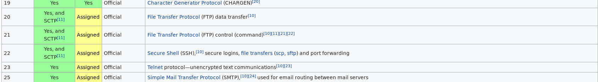
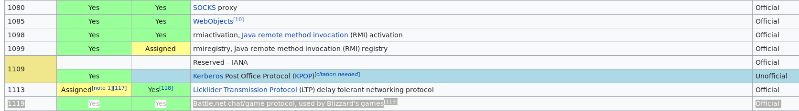
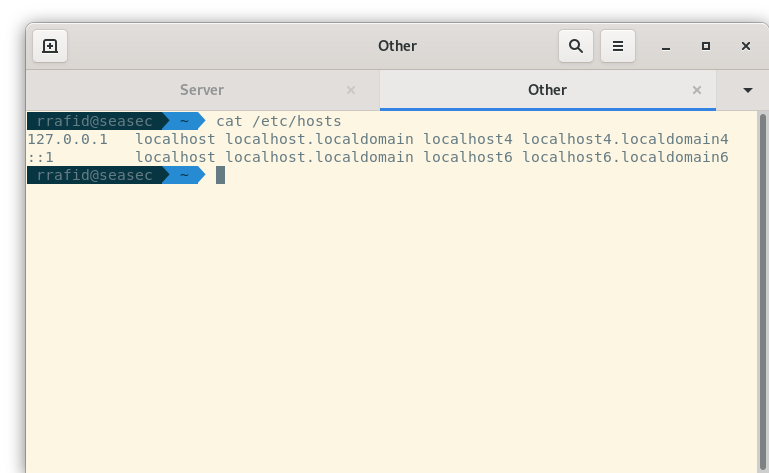
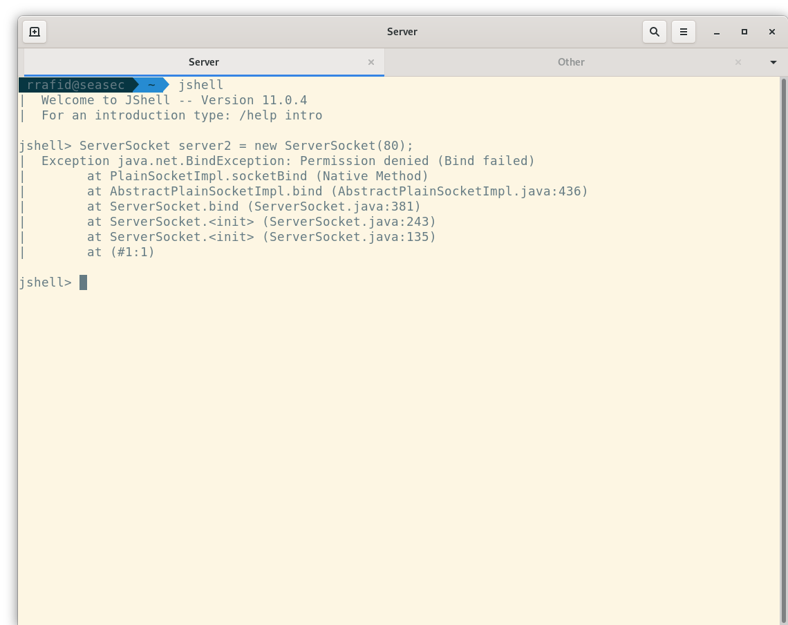
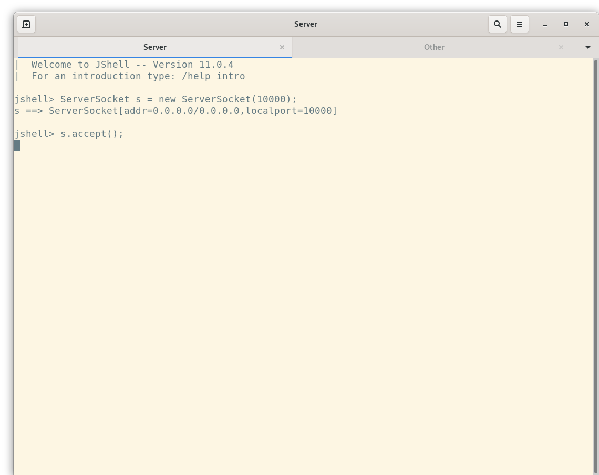
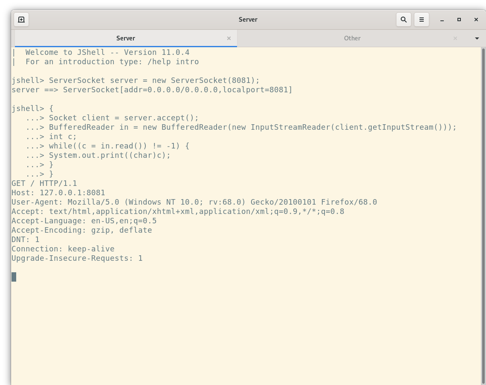
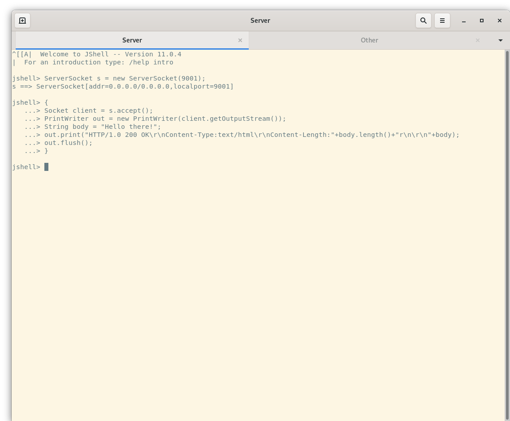
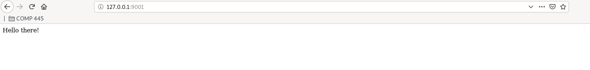

# COMP 445 HTTPfs Guide


## Legal Network Classes

The following classes are legal:

```
//Blocking Classes
java.net.Socket
java.net.ServerSocket

//Non Blocking Classes
java.nio.channels.SelectionKey
java.nio.channels.Selector
java.nio.channels.ServerSocketChannel
java.nio.channels.SocketChannel
java.nio.ByteBuffer
java.nio.Files

//Misc Classes
java.net.InetAddress
java.net.InetSocketAddress
java.net.URL
java.net.URI
<other typical classes>
```

The following classes are **NOT** legal:
```
java.net.HttpUrlConnection
java.net.HttpsUrlConnection
java.net.UrlConnection
java.net.JarUrlConnection 
<any wrapper classes for sockets from github>
<any wrapper classes attempting to make a socket's use 'simpler'>
```

## Definition

A server is a special process that runs in the background of a kernel. It is also referenced as a daemon, since it provides a service. It's purpose is to facilitate client requests.

Unlike a client (httpc), the server (httpfs) needs to have a 'unique' ip address and port number. This 'unique' (ip,port) pair allows for a communication to be established from the client to the server. 

### IP Address

The constraint of a server in this course is that it must use the loopback ip address.

The loopback IP address of a system depends from one system to another since the range of a loopback IP address is from
 _127.0.0.1_ to _127.255.255.254_ (or 127.0.0.1/8). However, many systems use _127.0.0.1_.
 
 To verify the loopback IP address, you can enter the following commands in terminal/cmd:
 ```
//On Mac/Linux:
$ifconfig | grep 127.

//On Windows (not too sure here):
ipconfig /all
//or
ping 127.0.0.1 //if successful, then it is that ip 
```   

### Port

Computer Systems have 65,535 different ports. Ports are classified into two categories: reserved and non-reserved (actually there are 3, but let's stay in scope).
```
Reserved port range: [1,2^10 - 1] = [1,1023]
Non-Reserved port range: [2^10,2^16 - 1] = [1024,65535]
```

For this course, the constraint is that the server cannot be assigned reserved ports. Additionally, a port must not be used by any other server/service.

**Keep this in mind**

Here is a (fun) example that can give you a little bit of insight as to why you cannot do this in the context of this course:





 

## Server Socket Constructors

A server socket is a special type of socket that listens for incoming client requests:

```
ServerSocket(int port);
ServerSocket(int port, int backlog, InetAddress bindAddr);
ServerSocket(InetSocketAddress bindAddr);
```

#### ServerSocket(port)

When this constructor is called, the default address is 0.0.0.0(/0.0.0.0) and the port number is the specified port number:

.png)

After declaring and initializing the ServerSocket object, notice that the address of the server is 0.0.0.0 with a subnet of 0.0.0.0.

This address is special to the ServerSocket object because it knows that for it to have an IP address, it needs to
check the system's hosts file for the localhost definition.

The hosts files of a machine is found in:
```
/etc/hosts - For systems running on a Linux/Mac kernel 
c:\Windows\System32\Drivers\etc\hosts - For systems running on a Windows 10 kernel
```



Overall, calling this constructor will create a ServerSocket object with the IP address of 127.0.0.1 and port 8080.

#### ServerSocket(port, backlog, bindAddr)

This constructor specifies the IP address, port number, and queue size of the ServerSocket.

Backlog is an attribute that defines the **maximum** allowable queue size when clients want to connect.

For example, if Bob and Marie use their httpc client to connect to a server with a backlog of 0, then either Bob or Marie 
will be 'serviced'. One of them kicked out of the connection and needs to reconnect to the server at a later time.

On the other hand, if the server had a backlog of 1, then either Bob or Marie will be 'serviced',
while the other waits for the server to 'serve' them. The person waiting in the queue remains connected. 

.png)


#### ServerSocket()

This constructor doesn't bind the ServerSocket to any IP address nor port number.

By itself, this constructor doesn't do much. However, when paired with ServerSocket's bind method, it becomes really useful:

.png)


### Limitations ###

A ServerSocket constructor can throw an Exception if the ip/port pair is either invalid,
bound to some other service, or is in the reserved list*:



## Server Socket Connection

Once a ServerSocket object has been successfully created, it can be used to listen for incoming requests from httpc:



The ServerSocket's accept method blocks the current thread until httpc connects to the specified ip address and port number.

Once the ServerSocket object connects with a client, it returns a new Socket object that can be used to respond
to the client in a very similar fashion that the httpc requests something from a server.


#### Server Socket Reader
In the example below, The web browser (= client = httpc) connected to the server. The server then
created a BufferedReader to read the request of the client. This request was printed locally on the server using System.out:


From this, we can assume that the client was using FireFox, set to the US-English language, with a request to keep the connection alive.
Notice that it's also a get request, that's why it contains no bodies.

#### Server Socket Writer
In the example below, The web browser(= client = httpc) connected to the server. The server (ignoring the request), decides to
output a simple hello message while respecting the **HTTP structure**:




On the client side (web browser = httpc), we will see this response:



## Server Logic

Servers need to understand requests coming from a client, and need to respond with an appropriate message.

This server will closely resemble an Apache (HTTP) Server, except we're doing it from ground up.

### Server Request
The server needs to be able to decode an incoming request by referring to the formatting rules of an HTTP Request: 

 

### Server Response
The server needs to adhere to the formatting rules of an HTTP Response:


- The Version field refers to the request message's version field.

- The Status Code and Phrase fields are self created by the server. It is **required** for the server to have at least all of the following
 status codes and phrases: 
    ```
    <Status Code : Phrase>
    <-- Definitions>
  
    200 : OK 
    -- Server successfully found the resource and has sent it back to the client. 
  
    404 : Not Found 
    -- Server has not found anything matching the requested URI.
    -- For example, if the client wants /directory/hello.txt, and the server doesn't have it in /directory/hello.txt
    
    201 : Created 
    -- Server has successfully created a resource from a POST ONLY request.
    -- It is NOT mandatory to return a URI entity.
    
    400 : Bad Request 
    -- Server doesn't understand the request.
    -- For example, if the request doesn't follow proper syntax or is malformed.
    
    403 : Forbidden 
    -- Server understood the request, but refuses to 'service' it. 
    -- For example, if the file has it's permissions set to not Readable/Writeable
    ```
- The Header Field name of the Server **should** contain the same Header fields of the client if it is a valid request. 
The server may add to the header field if required. For example, if the server responds to a GET request, it **should** contain
headers Content-Length and Content-Type.

- Entity Body is used only when a server receives a GET request. It needs to send a body of information to the client.
Otherwise for POST, it can simply use the status code and phrase to denote the server's response.

### Scenario
HTTPc client sends the following message:
```
GET /hello.txt HTTP/1.0
User-Agent: Concordia


```

HTTPfs server receives that message, and supposing that hello.txt exists, then will reply to the client by writing to its
output stream the following:

```
HTTP/1.0 200 OK
User-Agent: Concordia
Content-Length: 12
Content-Type: text/html

Hello World!
```

If the file does not exist, then the server replies with:

```
HTTP/1.0 400 Bad Request
User-Agent: Concordia


```

If the file was not publicly readable (_chmod_), then the server replies with:
```
HTTP/1.0 403 Forbidden
User-Agent: Concordia


```


## Requirements

### Syntax
It is **required** that the httpfs options have the following syntax:

```
    httpfs [-v] [-p PORT] [-d PATH-TO-DIR]
    httpfs //this prints HELP
```

- The options **should** be detected in an unordered fashion.

- The port number **should** be verified (see above discussion).

- The path root path of the server **should** be verified (must exist & must be a directory).
    - NOTE: Suppose the root path is _/home/user/Documents_. The server should understand this, and use it. The client, however
    does **not** need to specify _/home/user/Documents_ in the request path. It simply uses _/_. For example, _/home/user/Documents/_ contains file 
    _hello_. The client, httpc, will only request for _/hello_. The Server will understand that _/hello_ = _/home/user/Documents/hello_.       

-  Running verbose **should** print enough information on the server side for someone else to read it and understand it.

- There **should** be a default path if -d is not defined. This path must be safe, we do not want to accidentally change kernel files.

- There **should** be a default port of 8080 if -p is not defined.

 ### Logic
 
Please **read** the entire document for the lab. You will see the clear path to
how the server should respond in the described situations. 

Your server **should** be running in an infinite loop, especially after a client has completed their request. You can implement a
stop key to close the program. 

For a POST request, if the server doesn't have a path specified, it **should** handle it properly. For example:
```
httpc post -h Content-Length:12 -d "Hello world!" http://localhost:8080/hey/my/name/is/bob.txt
```

If it doesn't have the directories/file, the server will create the directories _hey, my, name, is_ and then the file _bob.txt_
containing the text _Hello world!_.

For a request, you **can** have httpc detect if the url contains an IP address or not. This will simplify your task:
```
httpc post -h Content-Length:12 -d "Hello world!" http://127.0.0.1:8080/bob.txt
//is equivalent to
httpc post -h Content-Length:12 -d "Hello world!" http://localhost:8080/bob.txt
```


### httpc

Your httpc client from Lab 1 **should** be able to connect to the server. For example, if the server has an IP address of 127.0.0.1 and port of 8080,
then running the following:
```
httpc (get|post) [-v] (-h k:v)* [-d data] [-f file] URL

where URL = http://localhost:8080/hello.txt
\\OR
URL = http://localhost:8080/hey/my/name/is/bob.txt
```

Should be valid (assuming that the file exists if GET). 
